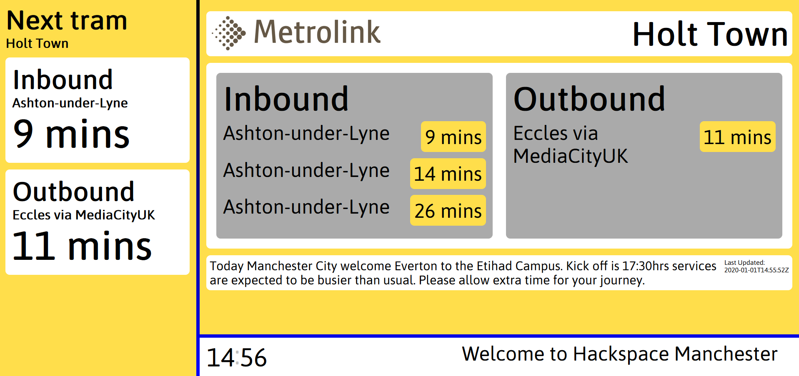

# Hackscreen 3

Third iteration of Hackscreen - a hackable, pluggable community noticeboard. Designed for Hackspace Manchester, go ahead and make this work for your space or community.

## Configuration

The config needs to live in `/config.json`
A sample `/config.example.json` is provided to guide you the right way. Screens are processed in order listed and show the given number of seconds.

The Footer is also where notifications are shown:

- Notification (covers the whole Footer)
- Jewel (a box in the footer that can "light up")

## Development

#### Client/Server communication

- The server runs integrations that can fetch data, listen to notifications, do actions.
- Sockets are used to talk to the client.
- The client then uses a React Provider to make data available to all files.
- The data from integrations is namespaced according to the integration name

#### Directories and key files

- server
  - integrations - add any data fetching or listening as a file in here
- src
  - Components - add any reusable components here
  - Footers - Things that live in the footer
  - Screens - Things that show on the main screen
  - Sidebars - things that show on the sidebar
  - App.scss - styles for the general screen
  - App.js - this runs the app

#### Adding a Screen/Sidebar/Footer

For example, we want to create a `Name` `Screen`:

- Create a directory: `/src/Screens/Name`
- Create `Name.jsx` and `Name.scss`
- Pur your React and Sass in
- update `/src/Screens/index.js` to export your new screen
- Update the config file if you'd like for your screen to show
